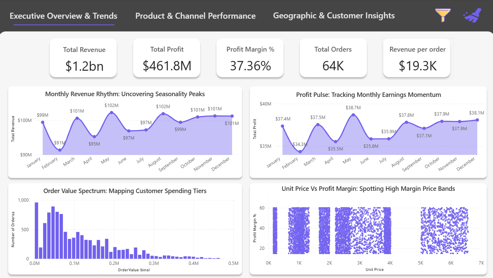
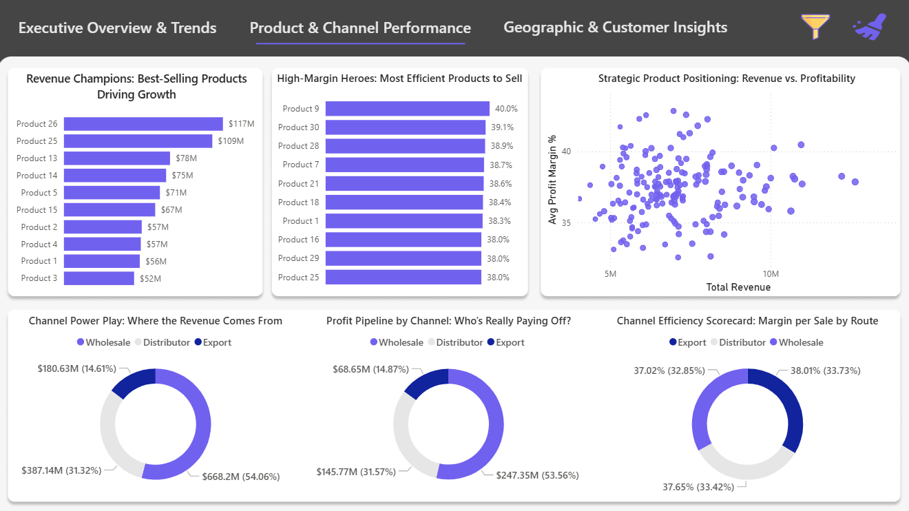
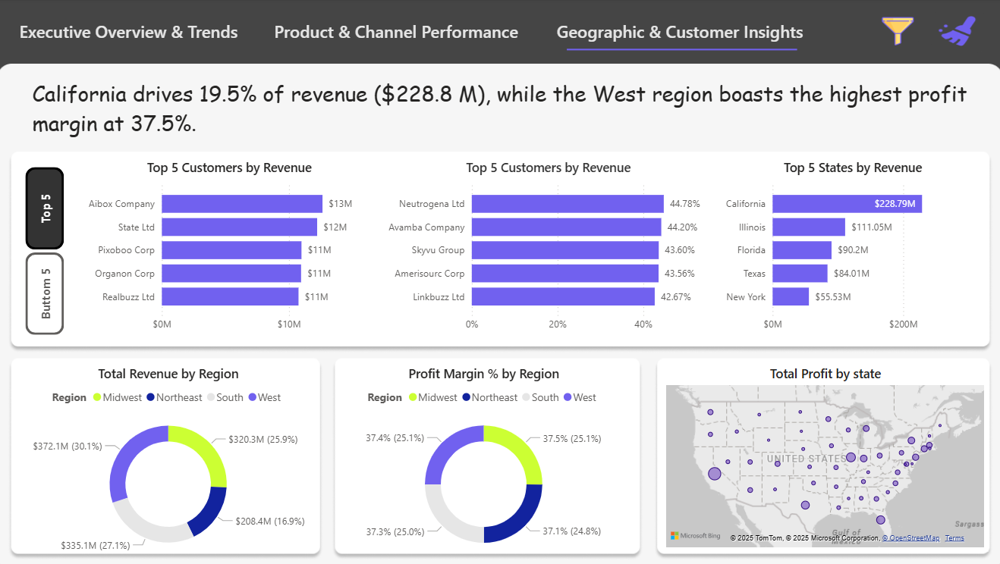
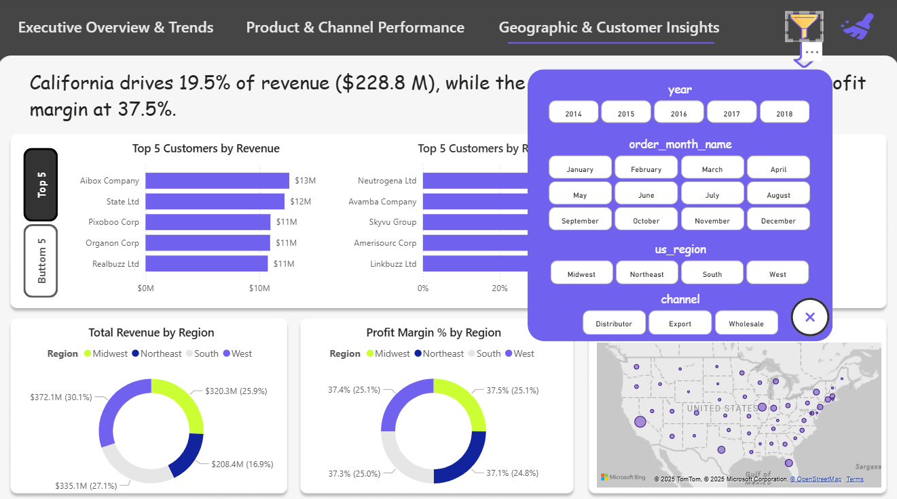

# 📊 Regional Sales Analytics: End-to-End Data Analysis & Dashboard Project

A complete data analytics project focused on analyzing regional sales performance across the U.S., using Python for data processing and Power BI for dashboard creation. This project demonstrates how to go from raw, multisource Excel data to a clean, insightful, and interactive dashboard that supports business decision-making.

---

## 🧠 Problem Statement

Businesses lacked visibility into:
- Seasonal revenue fluctuations
- Top-performing products (SKUs)
- Channel profitability
- Regional sales inconsistencies

📌 **Objective**: Use 5 years of historical sales data to generate actionable insights for revenue optimization, SKU performance, and regional strategies.

---

## 🗂️ Dataset Overview

📄 **Format**: Multi-sheet Excel  
📁 **Sheets**:
- Sales Orders
- Customers
- Products
- Regions
- State Regions
- 2017 Budget

🧩 **Key Relationships**:
- `Sales Orders` ←→ `Customers` (via customer index)
- `Sales Orders` ←→ `Products` (via product description index)
- `Sales Orders` ←→ `Regions` and `State Regions` (via region ID/state code)
- `Products` ←→ `2017 Budget` (via product name)

---

## 🧪 Tools & Technologies

| Area | Tools |
|------|-------|
| Data Analysis | Python, Pandas, NumPy, Matplotlib, Seaborn |
| Dashboarding | Power BI |
| Data Cleaning | Python |
| Data Integration | Excel, Power Query |
| Feature Engineering | Python |
| Visualization | Power BI, Python |

---

## 🔁 Project Workflow

1. **Business Understanding**
2. **Data Understanding & Collection**
3. **Preprocessing & Cleaning**
4. **Feature Engineering**
5. **Exploratory Data Analysis (EDA)**
6. **Insight Generation**
7. **Dashboard Creation (Power BI)**
8. **Deployment & Recommendations**

---

## 📌 Key Metrics & Engineered Features

- **Revenue** = Line Total  
- **Total Cost** = Order Quantity × Unit Cost  
- **Profit** = Revenue – Total Cost  
- **Profit Margin (%)** = (Profit / Revenue) × 100  
- **Average Order Value**  
- **Channel Revenue & Profit Split**

---

## 📈 Exploratory Data Analysis (EDA)

- **Time Series**: Revenue trends over months/years
- **Seasonality**: January low (~$95M), May peak (~$124M)
- **Top Products**: Products 26 & 25 drive 25% of total revenue
- **Channel Insights**:
  - Wholesale = 54% of sales volume
  - Export = Highest margins (~38%)
- **Top States**: California leads with $230M across 7.6K orders
- **Customer Segmentation**: Revenue vs. Profit clusters
- **Correlation**: Strong ties between Revenue, Profit, and Unit Price

---

## 📊 Power BI Dashboard

### 📌 Pages:
1. **Executive Overview & Trends**

3. **Product & Channel Performance**

5. **Geographic & Customer Insights**

### 💡 Features:
- KPI cards (Total Revenue, Profit, Profit Margin, etc.)
- Line charts, bar charts, pie charts, histograms
- Interactive filters: Year, Month, Region, Channel
- Slicers and bookmarks for seamless navigation
- Client-centric design with stakeholder-driven layout

---

## 🧠 Key Insights

- 📉 Sales dip sharply in April → ideal for promotional push
- 🔝 Small number of SKUs dominate sales
- 🌎 Regional dominance by California, Illinois, Florida
- 💸 Export channel provides highest profit margins
- 🎯 Clear revenue clusters help identify VIP customers

---

## ✅ Recommendations

- Launch **April recovery campaigns**
- Focus on **high-margin SKUs**, phase out low performers
- Expand **Export partnerships**
- Replicate **regional strategy** from California in other states
- Monitor **profit margin thresholds**

---

## 🚀 Outcomes

- 📌 Fully functional, interactive Power BI dashboard
- 📊 Cleaned and merged dataset from multiple sources
- 📎 Actionable insights for operations, marketing, and sales teams
- 📥 Ready for deployment with scheduled refresh and RLS options

---
